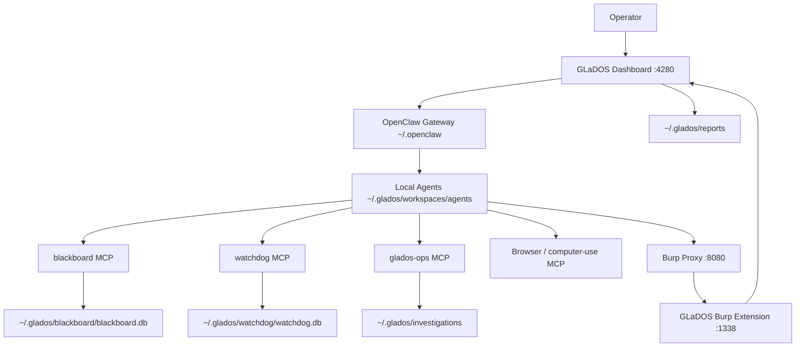
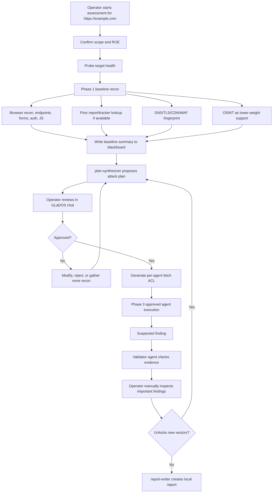

# GLaDOS

GLaDOS is a supervised local red team assessment framework built around OpenClaw agents, a local operator dashboard, Burp Suite observability, MCP tools, and local SQLite state. Each red teamer runs their own copy on their own workstation. Nothing is shared between users unless an operator explicitly exports and shares a report.

## Local-Only Model

The Git repo contains application code, scripts, docs, default agent seed templates, and MCP tooling. Runtime data belongs to the operator and lives outside the repo.

| Data | Location |
| --- | --- |
| Default upstream agent seeds | `templates/agents/default/<agent-id>/` |
| User-owned editable agents | `~/.glados/workspaces/agents/<agent-id>/` |
| Reports | `~/.glados/reports/<engagement>/` |
| Evidence | `~/.glados/investigations/<target>/evidence/` |
| Blackboard DB | `~/.glados/blackboard/blackboard.db` |
| Watchdog DB | `~/.glados/watchdog/watchdog.db` |
| OpenClaw config, sessions, memory | `~/.openclaw/` |
| Operator context | `~/.glados/operator-context.json` |
| Local secrets | `.env` and `~/.glados/secrets/local-auth.json` |

Updates never overwrite local agents, reports, investigations, blackboards, watchdog state, `.env`, or OpenClaw sessions.

## First Install

### 1. Install Prerequisites

On a fresh MacBook:

```bash
# Xcode command line tools
xcode-select --install

# Homebrew packages used by GLaDOS, OpenClaw, Burp extension builds, and agent tooling
brew install node git openjdk@21 openjdk@17 gradle jq ripgrep sqlite ollama ffuf nmap nuclei jadx apktool
brew install --cask ghidra

# Optional but recommended: make Java 21 available in shells
echo 'export JAVA_HOME=/opt/homebrew/opt/openjdk@21/libexec/openjdk.jdk/Contents/Home' >> ~/.zshrc
echo 'export PATH="/opt/homebrew/opt/openjdk@21/bin:$PATH"' >> ~/.zshrc
source ~/.zshrc
```

Install OpenClaw if it is not already installed:

```bash
npm install -g openclaw
```

Install Burp Suite Professional separately, then launch it at least once so the
extensions UI and user-level configuration exist.

### 2. Clone And Bootstrap

```bash
git clone <private-github-url> GLaDOS
cd GLaDOS
cp .env.example .env
# edit .env and add your own local LLM API key
scripts/bootstrap-macos.sh
scripts/setup-local-secrets.sh # optional, local workstation only
scripts/glados-doctor.sh
cd dashboard && npm start
```

Bootstrap copies the default agent seeds once into `~/.glados/workspaces/agents`, creates local runtime directories and DBs, installs Node dependencies, and generates `~/.openclaw/openclaw.json` so OpenClaw points at the local editable agents.

Bootstrap also installs a non-secret starter operator context from `templates/operator-context/ford-redteam.json` into `~/.glados/operator-context.json`. That file can contain background knowledge such as Ford-owned domain indicators, ADFS/SSO hosts, Dradis hosts, and reporting paths. It does not grant active testing scope by itself.

Credentials are local-only. Use `scripts/setup-local-secrets.sh` to create `~/.glados/secrets/local-auth.json` with workstation-specific credential profiles. GLaDOS can check which profiles exist, but the MCP status tool intentionally never returns usernames, passwords, tokens, or secret values.

The canonical report-writing template lives in Git at:

```text
templates/reporting/REPORT-TEMPLATE.md
```

Bootstrap also installs a neutral local fallback copy at:

```text
~/.glados/reports/REPORT-TEMPLATE.md
```

Report-writing agents prefer the repo template path and use the local fallback
only if the repo path is unavailable.

### 3. Ollama Setup

GLaDOS can use local Ollama models for agents configured with the
`ollama-local` provider. Start Ollama and pull the default local model:

```bash
brew services start ollama
ollama pull glm-4.7-flash:latest
curl -s http://localhost:11434/api/tags | jq .
```

The default local provider is configured in `~/.openclaw/openclaw.json` during
bootstrap with:

```text
OLLAMA_BASE_URL=http://localhost:11434/v1/
GLADOS_LOCAL_MODEL=glm-4.7-flash:latest
```

Change those in `.env`, then run `scripts/update-macos.sh` if a workstation
uses a different local model.

### 4. Burp Suite Integration

GLaDOS expects Burp to be listening as the operator HTTP workbench:

```text
Burp Proxy:            127.0.0.1:8080
GLaDOS Burp extension: 127.0.0.1:1338
Optional Burp API:     127.0.0.1:1337
```

Build the GLaDOS Montoya extension:

```bash
cd tools/burp-ext-glados-proxy-api
./gradlew shadowJar
```

Load the extension in Burp:

1. Burp Suite → Extensions → Installed → Add.
2. Extension type: Java.
3. Extension file:
   `tools/burp-ext-glados-proxy-api/build/libs/glados-proxy-api-1.0.0-all.jar`
4. Confirm Burp output says the extension is listening on
   `http://127.0.0.1:1338`.

Verify:

```bash
curl -s http://127.0.0.1:1338/health | jq .
```

Then patch OpenClaw's runtime bundle so agent HTTP traffic is attributed and
routed through Burp:

```bash
tools/patch-openclaw-bundle.sh
openclaw daemon restart
```

If OpenClaw is upgraded with `npm install -g openclaw`, re-run the patch script.
The dashboard health banner will warn when the patch markers are missing.

### 5. MCP Servers And Agent Tools

No separate MCP registration step is required. `scripts/bootstrap-macos.sh`
installs the MCP server dependencies and writes them into
`~/.openclaw/openclaw.json`:

- `blackboard` MCP — findings, tasks, baseline recon, plans, approvals
- `watchdog` MCP — target health, halt/resume, circuit breaker, plan gate
- `glados-ops` MCP — operator context, local auth status, scope guard,
  browser/auth helpers, evidence helpers
- `computer-use` MCP — included if already installed on the workstation

The Homebrew tools above are available to agents through the generated OpenClaw
`PATH`. `ffuf`, `nmap`, and `nuclei` support web/API recon and validation.
`jadx`, `apktool`, and `Ghidra` support mobile/binary/reversing workflows when
those agents are used.

### 6. Start GLaDOS

```bash
cd dashboard
npm start
```

Open:

```text
http://localhost:4280
```

## Updating

```bash
git pull
scripts/update-macos.sh
scripts/glados-doctor.sh
```

`scripts/update-macos.sh` updates code dependencies and regenerates OpenClaw registration from local agents. It does not copy changed seed files over local agents. If upstream templates changed, status is written to:

```text
~/.glados/upstream-agent-status.json
```

That file can show:

- New upstream agent available
- Upstream template changed
- Local agent differs from installed seed
- Local agent removed by user
- Custom local agent detected

Applying upstream agent changes is an operator decision, not an automatic update.

Updates do not overwrite `~/.glados/operator-context.json` or `~/.glados/secrets/local-auth.json`. If the committed operator context template changes, teammates can review it and refresh their local copy intentionally with:

```bash
scripts/setup-operator-context.sh --force
```

## Customizing Agents

Each operator owns their local agents:

```text
~/.glados/workspaces/agents/<agent-id>/
```

Common editable files:

- `IDENTITY.md`
- `SOUL.md`
- `RUNBOOK.md`
- `TOOLS.md`
- `USER.md`
- `AGENTS.md`
- `skills/`
- `agent.json`

To disable an agent, set `"enabled": false` in `agent.json` or add a `.disabled` file in the agent folder, then run:

```bash
scripts/update-macos.sh
```

To add a custom agent, create a new folder under `~/.glados/workspaces/agents/<new-id>/` with an `agent.json` file. The updater will register it without touching upstream seeds.

## Architecture



Core pieces:

- Dashboard: chat, live transcripts, Proxy tab, Reports tab, health banners, halt/resume controls.
- OpenClaw: runs GLaDOS and subagents, stores local sessions, streams JSONL and raw token events.
- Agents: editable local workspaces that define identity, runbook, tools, and skills.
- Blackboard MCP: shared local SQLite state for findings, tasks, baseline recon, plans, approvals, and replans.
- Watchdog MCP: target health, halts, circuit breaker, and deterministic plan dispatch checks.
- GLaDOS ops MCP: scope guard checks, evidence bundle creation, JS/OpenAPI extraction, and safe command planning.
- Operator context: non-secret background knowledge available to GLaDOS through `glados-ops.operator_context`.
- Local auth status: redacted credential-profile availability through `glados-ops.local_auth_status`; credential values stay local and are not returned to agents.
- Burp integration: routes active web traffic through Burp, attributes requests per agent, and exposes proxy history/metrics to the dashboard.

## Web App Assessment Flow



## Simulated Example: `https://example.com/`

1. The operator tells GLaDOS: assess `https://example.com/`.
2. GLaDOS confirms scope and probes target health through watchdog.
3. Phase 1 begins. `webapp-recon` opens the site with the browser MCP, maps pages and forms, records headers and cookies, and identifies a search endpoint at `/search?q=`.
4. DNS/TLS data is recorded. Prior report lookup finds no prior findings. OSINT finds public references, but GLaDOS treats that as lower-weight support.
5. GLaDOS writes a baseline summary to the blackboard.
6. `plan-synthesizer` proposes a plan:
   - Test search/query parameters for SQL injection, CWE-89.
   - Test object IDs for IDOR, CWE-639.
   - Review JavaScript endpoints for API exposure.
   - Keep testing low-rate and route active traffic through Burp.
7. GLaDOS tells the operator the plan in chat and waits for approve, selected approve, modify, or reject.
8. The operator approves the SQL injection validation vector.
9. The approved plan generates a fetch ACL so only the selected agents can touch the scoped hosts.
10. `webapp-vuln` tests the approved parameter and observes SQL error behavior. It reports evidence, confidence, endpoint, request/response summary, and risk.
11. `webapp-validator` independently checks the behavior with safe negative controls.
12. GLaDOS asks the operator to manually inspect the evidence before treating it as confirmed.
13. If confirmed, GLaDOS records the finding in the blackboard and asks whether follow-on testing is allowed. If the finding unlocks a new vector, GLaDOS halts and proposes a replan.
14. `report-writer` writes the report under `~/.glados/reports/example-com-YYYYMMDD/`.
15. `report-validator` reviews it before handoff.

## Reports

Reports are local-only:

```text
~/.glados/reports/<engagement>/
```

Evidence bundles and screenshots are local-only:

```text
~/.glados/investigations/<target>/evidence/
```

The dashboard Reports tab reads from the local reports and investigations roots. To export a report:

```bash
scripts/export-report.sh <engagement>
```

The export is written under:

```text
~/.glados/exports/
```

## Repo Hygiene

Before pushing:

```bash
scripts/prepush-secret-scan.sh
```

The scan blocks common credential patterns and runtime artifacts such as `.env`, reports, investigations, DBs, sessions, Burp exports, and known private identifiers. Keep operator data in `~/.glados` and `~/.openclaw`, not in Git.

## Production Readiness Checks

```bash
scripts/glados-doctor.sh
```

Doctor verifies:

- Runtime paths are outside the repo.
- OpenClaw agents point at `~/.glados/workspaces/agents`.
- Reports and investigations are local.
- Local DB paths exist.
- Secret scan passes for distributable source.
