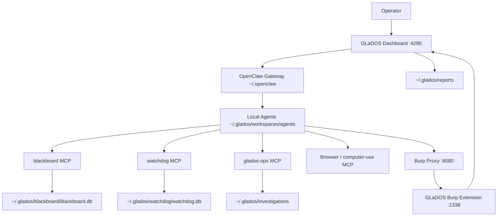
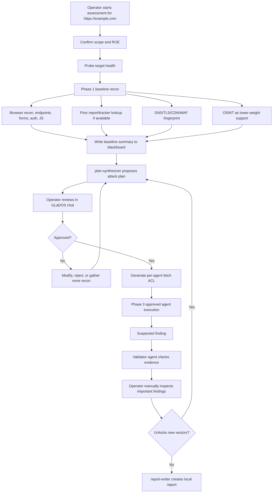

# GLaDOS

GLaDOS is a supervised local red team assessment framework built around OpenClaw agents, a local operator dashboard, Burp Suite observability, MCP tools, and local SQLite state. Each red teamer runs their own copy on their own workstation. Nothing is shared between users unless an operator explicitly exports and shares a report.

## Local-Only Model

The Git repo contains application code, scripts, docs, default agent seed templates, and MCP tooling. Runtime data belongs to the operator and lives outside the repo.

| Data | Location |
| --- | --- |
| Default upstream agent seeds | `templates/agents/default/<agent-id>/` |
| User-owned editable agents | `~/.glados/workspaces/agents/<agent-id>/` |
| Reports | `~/.glados/reports/<engagement>/` |
| Evidence | `~/.glados/investigations/<target>/evidence/` |
| Blackboard DB | `~/.glados/blackboard/blackboard.db` |
| Watchdog DB | `~/.glados/watchdog/watchdog.db` |
| OpenClaw config, sessions, memory | `~/.openclaw/` |
| Operator context | `~/.glados/operator-context.json` |
| Local secrets | `.env` and `~/.glados/secrets/local-auth.json` |

Updates never overwrite local agents, reports, investigations, blackboards, watchdog state, `.env`, or OpenClaw sessions.

## First Install

### 1. Install Prerequisites

On a fresh MacBook, install Apple Command Line Tools, Homebrew, and the
GLaDOS workstation dependencies. Use Node 22 LTS; Homebrew's latest `node`
can be too new for native dashboard dependencies.

```bash
xcode-select --install

if [[ -x /opt/homebrew/bin/brew ]]; then
  eval "$(/opt/homebrew/bin/brew shellenv)"
else
  eval "$(/usr/local/bin/brew shellenv)"
fi
BREW_PREFIX="$(brew --prefix)"

brew install node@22 git openjdk@21 openjdk@17 gradle jq ripgrep sqlite ffuf nmap nuclei jadx apktool
brew install --cask ghidra

brew link --overwrite --force node@22

echo "export JAVA_HOME=\"$BREW_PREFIX/opt/openjdk@21/libexec/openjdk.jdk/Contents/Home\"" >> ~/.zshrc
echo "export PATH=\"$BREW_PREFIX/opt/node@22/bin:$BREW_PREFIX/opt/openjdk@21/bin:$BREW_PREFIX/bin:\$PATH\"" >> ~/.zshrc
source ~/.zshrc

sudo mkdir -p /Library/Java/JavaVirtualMachines
sudo ln -sfn "$BREW_PREFIX/opt/openjdk@17/libexec/openjdk.jdk" /Library/Java/JavaVirtualMachines/openjdk-17.jdk
```

Do not install Ollama for the standard HPC/LiteLLM workstation path.
GLaDOS uses the remote LiteLLM-compatible provider configured in `.env`.

Install Burp Suite Professional separately, then launch it at least once so
the extensions UI and user-level configuration exist.

### 2. Clone And Bootstrap

Use the private Gitea repo when available. If the operator cannot access
Gitea, use the public GitHub mirror.

```bash
cd ~/Desktop
git clone https://github.com/samcsta/GLaDOS.git
cd GLaDOS

cp .env.example .env
# edit .env and set LLMAPI_API_KEY to the workstation's HPC/LiteLLM key
scripts/bootstrap-macos.sh
scripts/glados-doctor.sh
```

Bootstrap copies the default agent seeds once into `~/.glados/workspaces/agents`, creates local runtime directories and DBs, installs Node dependencies, and generates `~/.openclaw/openclaw.json` so OpenClaw points at the local editable agents.

Bootstrap also installs a non-secret starter operator context from `templates/operator-context/ford-redteam.json` into `~/.glados/operator-context.json`. That file can contain background knowledge such as Ford-owned domain indicators, ADFS/SSO hosts, Dradis hosts, and reporting paths. It does not grant active testing scope by itself.

Credentials are local-only. Use `scripts/setup-local-secrets.sh` to create `~/.glados/secrets/local-auth.json` with workstation-specific credential profiles. GLaDOS can check which profiles exist, but the MCP status tool intentionally never returns usernames, passwords, tokens, or secret values.

The canonical report-writing template lives in Git at:

```text
templates/reporting/REPORT-TEMPLATE.md
```

Bootstrap also installs a neutral local fallback copy at:

```text
~/.glados/reports/REPORT-TEMPLATE.md
```

Report-writing agents prefer the repo template path and use the local fallback
only if the repo path is unavailable.

### 3. OpenClaw Setup

GLaDOS currently pins OpenClaw to the version compatible with
`tools/patch-openclaw-bundle.sh` and installs older optional channel
dependencies that OpenClaw 2026.4.5 expects at runtime.

```bash
scripts/setup-openclaw-macos.sh --no-start
```

Important: do not export `OPENCLAW_HOME=$HOME/.openclaw` before running
OpenClaw CLI commands. OpenClaw interprets that as a base directory and will
look for `~/.openclaw/.openclaw/openclaw.json`. If in doubt, run OpenClaw
commands as:

```bash
env -u OPENCLAW_HOME openclaw gateway status --deep
```

### 4. Burp Suite Integration

GLaDOS expects Burp to be listening as the operator HTTP workbench:

```text
Burp Proxy:            127.0.0.1:8080
GLaDOS Burp extension: 127.0.0.1:1338
Optional Burp API:     127.0.0.1:1337
```

Build the GLaDOS Montoya extension:

```bash
cd tools/burp-ext-glados-proxy-api
export JAVA_HOME=$(/usr/libexec/java_home -v 17)
./gradlew shadowJar
```

Load the extension in Burp:

1. Burp Suite → Extensions → Installed → Add.
2. Extension type: Java.
3. Extension file:
   `tools/burp-ext-glados-proxy-api/build/libs/glados-proxy-api-1.0.0-all.jar`
4. Confirm Burp output says the extension is listening on
   `http://127.0.0.1:1338`.

Verify:

```bash
curl -s http://127.0.0.1:1338/health | jq .
```

Then patch OpenClaw's runtime bundle so agent HTTP traffic is attributed and
routed through Burp:

```bash
cd ~/Desktop/GLaDOS
scripts/setup-openclaw-macos.sh
```

The setup script installs the compatible OpenClaw version, re-applies the
GLaDOS bundle patches, writes the gateway LaunchAgent `NODE_OPTIONS` preload
for `tools/tag-injector.js`, and restarts the gateway.

Verify:

```bash
env -u OPENCLAW_HOME openclaw gateway status --deep
cat ~/.openclaw/logs/tag-injector-health.json | jq .
jq -r '.models.providers | keys[]' ~/.openclaw/openclaw.json
jq '.agents.list | length' ~/.openclaw/openclaw.json
jq -r '[.agents.list[].id | select(test("^(c2|phish|postex)"))] | join(",")' ~/.openclaw/openclaw.json
jq -r '[.agents.defaults.subagents.allowAgents[] | select(.=="atlas" or .=="glados")] | join(",")' ~/.openclaw/openclaw.json
jq -r '.agents.list[].model' ~/.openclaw/openclaw.json | sort | uniq -c
```

Expected stable values:

- Provider output includes `custom-llmapi-redteamstuff-com`.
- Active agent count is `25`.
- The high-risk active-agent check returns an empty string because `c2-*`,
  `phish-*`, and `postex-*` are disabled by default.
- The subagent allow-list check returns an empty string because neither `atlas`
  nor `glados` is dispatchable as a subagent.

Exact model counts can vary because local per-agent model overrides are
preserved across updates.

### 5. MCP Servers And Agent Tools

No separate MCP registration step is required. `scripts/bootstrap-macos.sh`
installs the MCP server dependencies and writes them into
`~/.openclaw/openclaw.json`:

- `blackboard` MCP — findings, tasks, baseline recon, plans, approvals
- `watchdog` MCP — target health, halt/resume, circuit breaker, plan gate
- `glados-ops` MCP — operator context, local auth status, scope guard,
  browser/auth helpers, evidence helpers
- `computer-use` MCP — included if already installed on the workstation

The Homebrew tools above are available to agents through the generated OpenClaw
`PATH`. `ffuf`, `nmap`, and `nuclei` support web/API recon and validation.
`jadx`, `apktool`, and `Ghidra` support mobile/binary/reversing workflows when
those agents are used.

### 6. Start GLaDOS

```bash
cd dashboard
npm start
```

Open:

```text
http://localhost:4280
```

If the dashboard Terminal tab is unavailable on a fresh Mac, the rest of
GLaDOS can still run. `dashboard/scripts/ensure-pty-binary.js` treats the
`node-pty` native rebuild as optional unless `GLADOS_STRICT_PTY=1` is set.

## Updating

One command does everything — `git pull origin main`, install deps for **all** packages
(dashboard + the 4 MCP servers), run DB migrations, regenerate the OpenClaw config, restart the
gateway, and run the doctor:

```bash
scripts/update.sh
```

On macOS the updater prefers `/usr/bin/git` to avoid Homebrew Git/libcurl
linkage issues seen on fresh Intel Macs. If you need a different Git binary,
run with `GLADOS_GIT=/path/to/git scripts/update.sh`.

Flags:

- `--dry-run` — show the incoming commits and what would change, then exit (no changes).
- `--with-openclaw` — also reinstall/patch OpenClaw and the gateway LaunchAgent (use when the pinned
  OpenClaw version bumps).
- `--no-restart` — skip restarting the gateway daemon.
- `--force` — proceed even if the working tree is dirty or you're not on `main`.

It is idempotent (re-running with no new commits is a no-op) and preserves all local state: agents,
reports, investigations, blackboard, watchdog, operator-context, local-auth, `.env`, **per-agent
model overrides** (see [Customizing Agents](#customizing-agents)), and OpenClaw sessions.
`scripts/update-macos.sh` is a backwards-compatible alias for `scripts/update.sh`.

The update regenerates OpenClaw registration from local agents. It does not copy changed seed files
over local agents. If upstream templates changed, status is written to:

```text
~/.glados/upstream-agent-status.json
```

That file can show:

- New upstream agent available
- Upstream template changed
- Local agent differs from installed seed
- Local agent removed by user
- Custom local agent detected

Applying upstream agent changes is an operator decision, not an automatic update.

Updates do not overwrite `~/.glados/operator-context.json` or `~/.glados/secrets/local-auth.json`. If the committed operator context template changes, teammates can review it and refresh their local copy intentionally with:

```bash
scripts/setup-operator-context.sh --force
```

## Versioning

The dashboard Settings tab displays the repo `VERSION` file. GLaDOS release
markers use:

```text
v<major>.<MMDDYYYY>.<daily-update-number>
```

Example: `v3.5.06162026.1`. For another update on the same day, bump to
`v3.5.06162026.2`; on a new day, reset the final number to `1`.

Use the helper before committing a release update:

```bash
scripts/bump-version.sh
```

## Customizing Agents

Each operator owns their local agents:

```text
~/.glados/workspaces/agents/<agent-id>/
```

Common editable files:

- `IDENTITY.md`
- `SOUL.md`
- `RUNBOOK.md`
- `TOOLS.md`
- `USER.md`
- `AGENTS.md`
- `skills/`
- `agent.json`

To disable an agent, set `"enabled": false` in `agent.json` or add a `.disabled` file in the agent folder, then run:

```bash
scripts/update-macos.sh
```

To add a custom agent, create a new folder under `~/.glados/workspaces/agents/<new-id>/` with an `agent.json` file. The updater will register it without touching upstream seeds.

### Per-agent model assignments (survive updates)

A fresh install runs every agent on the default Sonnet model. To offset cost you can move
individual agents to a cheaper HPC-hosted model (e.g. `minimax-m2.7`, `qwen3.6-27b-fp8`) — and those
choices now **persist across every `git pull` + update**.

Assign models either way:

- **Dashboard** — use the model picker in the agent panel / ChatBot tab. It writes your choice to the
  durable store automatically.
- **By hand** — edit `~/.glados/model-overrides.json` (a flat `{"<agent-id>": "<provider/model>"}`
  map). Seed it with `scripts/setup-model-overrides.sh`; see
  `templates/model-overrides.example.json` for the format. Apply with `scripts/update.sh`.

This file lives outside the repo (gitignored), is read on every config regen, and **always wins**
over the registry default (it is applied verbatim and is not affected by `GLADOS_DISABLE_OLLAMA`).
Do **not** hand-edit `~/.openclaw/openclaw.json` — it is generated and will be overwritten.

#### Response speed: pick the right model

Some cheap HPC reasoning models (e.g. `minimax-m2.7`) are slow on the LiteLLM gateway and **always**
emit reasoning regardless of any thinking/level setting — so they make a poor conversational
assistant (20s+ for a trivial reply). For a snappy agent like Atlas, switch it (via the model
picker) to a fast **non-reasoning** model such as `gemini-2.5-flash-lite`, `gemini-3.1-flash-lite-preview`,
or `gemma-4-31b-it-fp8`. For smart **and** fast, `claude-sonnet-4-6` reasons *adaptively* (it scales
effort per message). Sonnet agents like GLaDOS already get adaptive reasoning by default. See
[docs/model-customization.md](docs/model-customization.md).

## Architecture



Core pieces:

- Dashboard: chat, live transcripts, Proxy tab, Reports tab, health banners, halt/resume controls.
- OpenClaw: runs GLaDOS and subagents, stores local sessions, streams JSONL and raw token events.
- Agents: editable local workspaces that define identity, runbook, tools, and skills.
- Blackboard MCP: shared local SQLite state for findings, tasks, baseline recon, plans, approvals, and replans.
- Watchdog MCP: target health, halts, circuit breaker, and deterministic plan dispatch checks.
- GLaDOS ops MCP: scope guard checks, evidence bundle creation, JS/OpenAPI extraction, and safe command planning.
- Operator context: non-secret background knowledge available to GLaDOS through `glados-ops.operator_context`.
- Local auth status: redacted credential-profile availability through `glados-ops.local_auth_status`; credential values stay local and are not returned to agents.
- Burp integration: routes active web traffic through Burp, attributes requests per agent, and exposes proxy history/metrics to the dashboard.

## Web App Assessment Flow



## Simulated Example: `https://example.com/`

1. The operator tells GLaDOS: assess `https://example.com/`.
2. GLaDOS confirms scope and probes target health through watchdog.
3. Phase 1 begins. `webapp-recon` opens the site with the browser MCP, maps pages and forms, records headers and cookies, and identifies a search endpoint at `/search?q=`.
4. DNS/TLS data is recorded. Prior report lookup finds no prior findings. OSINT finds public references, but GLaDOS treats that as lower-weight support.
5. GLaDOS writes a baseline summary to the blackboard.
6. `plan-synthesizer` proposes a plan:
   - Test search/query parameters for SQL injection, CWE-89.
   - Test object IDs for IDOR, CWE-639.
   - Review JavaScript endpoints for API exposure.
   - Keep testing low-rate and route active traffic through Burp.
7. GLaDOS tells the operator the plan in chat and waits for approve, selected approve, modify, or reject.
8. The operator approves the SQL injection validation vector.
9. The approved plan generates a fetch ACL so only the selected agents can touch the scoped hosts.
10. `webapp-vuln` tests the approved parameter and observes SQL error behavior. It reports evidence, confidence, endpoint, request/response summary, and risk.
11. `webapp-validator` independently checks the behavior with safe negative controls.
12. GLaDOS asks the operator to manually inspect the evidence before treating it as confirmed.
13. If confirmed, GLaDOS records the finding in the blackboard and asks whether follow-on testing is allowed. If the finding unlocks a new vector, GLaDOS halts and proposes a replan.
14. `report-writer` writes the report under `~/.glados/reports/example-com-YYYYMMDD/`.
15. `report-validator` reviews it before handoff.

## Reports

Reports are local-only:

```text
~/.glados/reports/<engagement>/
```

Evidence bundles and screenshots are local-only:

```text
~/.glados/investigations/<target>/evidence/
```

The dashboard Reports tab reads from the local reports and investigations roots. To export a report:

```bash
scripts/export-report.sh <engagement>
```

The export is written under:

```text
~/.glados/exports/
```

## Repo Hygiene

Before pushing:

```bash
scripts/prepush-secret-scan.sh
```

The scan blocks common credential patterns and runtime artifacts such as `.env`, reports, investigations, DBs, sessions, Burp exports, and known private identifiers. Keep operator data in `~/.glados` and `~/.openclaw`, not in Git.

## Production Readiness Checks

```bash
scripts/glados-doctor.sh
```

Doctor verifies:

- Runtime paths are outside the repo.
- OpenClaw agents point at `~/.glados/workspaces/agents`.
- Reports and investigations are local.
- Local DB paths exist.
- Secret scan passes for distributable source.
