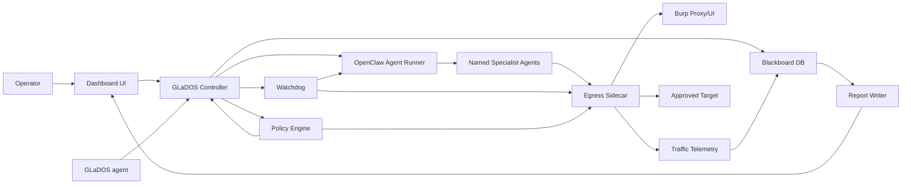

# GLaDOS Architecture Recommendations

This is an opinionated review of the v3.1.04242026 architecture after the
current recommended fixes:

1. Register `blackboard_mcp`.
2. Add a hard dispatch/plan gate.
3. Strengthen `halt-all` to deny network-capable tools for all agents.
4. Finish and verify Proxy Tier 2 UX.

The theme: GLaDOS is becoming powerful, but some problems are being solved in
the wrong layer. The biggest improvement is to move safety, dispatch, and state
transitions out of prompts and into one small deterministic control plane.

## Executive Summary

GLaDOS works best as an operator cockpit plus policy-enforced agent runner. It
works worst when every agent is expected to remember process rules from markdown
and independently mutate shared state.

The architecture is promising, especially the dashboard, Burp observability,
watchdog, and plan approval work. The ineffective parts are mostly places where
the system uses:

- prompt instructions where code-level gates are needed,
- passive database rows where a real queue/state machine is needed,
- patched third-party internals where a sidecar/proxy boundary would be cleaner,
- too many agent-local docs where a shared capability registry would be clearer,
- duplicated "truth" across markdown, SQLite, OpenClaw JSON, and dashboard state.

## What Seems Ineffective

### 1. Prompt-Enforced Workflow Invariants

Current shape:

- `SOUL.md` says no exploitation before plan approval.
- GLaDOS is expected to refuse if no approved plan exists.
- Agents are expected to respect their phase.

Why this is weak:

- It relies on the model remembering the rule during a long engagement.
- It is hard to audit after the fact.
- It does not protect against a malformed dispatch, stale context, or an agent
  receiving direct instructions from another surface.

Better shape:

- A deterministic dispatch gate decides whether an agent may run.
- Every dispatch goes through `dispatch_request(...)`.
- The gate checks target health, plan approval, allowed vectors, agent phase,
  RoE scope, active halt state, and fetch ACL.

Recommendation:

Make GLaDOS stop directly dispatching agents. GLaDOS should request dispatch
from a small controller:

```text
GLaDOS -> dispatch_request(agent_id, engagement_id, target_url, vector)
       -> policy check
       -> OpenClaw named-agent send/spawn
       -> audit event
```

This gives you one choke point for plan approval, target health, dedup, and
halt state.

### 2. Blackboard Tasks Are Not a Queue

Current shape:

- `blackboard_task_create` inserts a task row.
- Docs sometimes imply tasks are dispatches.
- Nothing consumes those rows.

Why this is weak:

- It creates a false sense of orchestration.
- A task can be "pending" forever with no executor.
- Agents and dashboard may disagree about whether work is actually running.

Better shape:

Pick one:

- Rename blackboard tasks to `audit_tasks` or `work_items` and document that
  they are records only.
- Or implement a real queue with states: `queued -> leased -> running ->
  completed|failed|cancelled`.

Recommendation:

Do not make the blackboard itself the dispatcher. Keep it as durable shared
state, and add a separate `glados-controller` process or MCP that owns queue
leasing and OpenClaw dispatch.

### 3. Too Much State Lives In Markdown

Current shape:

- `SOUL.md`, `REDTEAM_MASTER.md`, `MEMORY.md`, `webapp-assessment-playbook.md`,
  role docs, skills, and `TOOLS.md` files all encode operational rules.

Why this is weak:

- Rules drift.
- Contradictions appear, such as named-session dispatch versus `sessions_spawn`
  report dispatch.
- It is hard to know which file wins.

Better shape:

Separate "human-readable doctrine" from "machine-enforced policy":

- Markdown: rationale, examples, operator guidance.
- JSON/YAML policy: phases, agents, allowed actions, gates, required evidence.
- Code: enforcement.

Recommendation:

Create a single policy file:

```text
config/glados-policy.yaml
```

It should define:

- agent roles and phases,
- network-capable agents,
- validator pairs,
- required gates per phase,
- evidence requirements,
- allowed dispatch primitive per agent,
- report-writing exceptions.

Then render parts of that policy into docs, rather than making docs the source
of truth.

### 4. Patching OpenClaw Bundles Is Fragile

Current shape:

- `patch-openclaw-bundle.sh` string-patches minified OpenClaw bundles.
- `tag-injector.js` verifies markers and warns if patches vanished.

Why this is weak:

- OpenClaw upgrades can silently move the patch point.
- String needles are brittle.
- The runtime safety boundary lives inside third-party internals.

Better shape:

Move egress control outside OpenClaw where possible:

- local sidecar proxy,
- per-agent identity passed by environment or launcher,
- proxy-enforced ACL,
- Burp/mitmproxy/Caido-style HTTP boundary,
- OS-level firewall fallback for emergency stop.

Recommendation:

Keep the patch for v3.1 if it is working, but treat it as transitional. For
v3.2, replace most bundle patching with a sidecar:

```text
Agent tool HTTP -> local sidecar proxy -> Burp -> target
                       |
                       +-> identity, ACL, rate limit, logs, kill switch
```

The sidecar should be the enforcement point for:

- agent identity,
- fetch ACL,
- HMAC/header verification,
- rate limits,
- target allowlists,
- replay labeling,
- emergency denial.

### 5. Burp Is Doing Too Many Jobs

Current shape:

- Burp is the proxy, visibility layer, history store, replay path, RPS source,
  and part of the kill switch.

Why this is weak:

- Burp API behavior varies by version.
- Burp is interactive/operator software, not a guaranteed policy engine.
- If Burp is down or misconfigured, safety and observability degrade together.

Better shape:

Burp should remain the operator's HTTP workbench. A GLaDOS sidecar should own
machine-enforced policy and durable telemetry.

Recommendation:

Long term, do this:

```text
Agents -> GLaDOS egress sidecar -> Burp proxy -> target
             |
             +-> SQLite/JSONL telemetry
             +-> ACL enforcement
             +-> circuit breaker
             +-> kill switch
```

Burp then becomes one consumer/view of traffic, not the only source of truth.

### 6. Per-Agent Workspaces Are Useful But Under-Specified

Current shape:

- You have many named agents with good identities.
- Many `TOOLS.md` files are generic templates.
- Behavior depends heavily on global GLaDOS docs.

Why this is weak:

- Specialist agents may improvise inconsistent methodology.
- Validation quality varies by model and stale context.
- Tool permissions are not clearly mapped to role responsibilities.

Better shape:

Give each agent a short, strict contract:

- inputs it expects,
- outputs it must produce,
- files it may write,
- tools it may use,
- evidence schema,
- stop conditions,
- validator handoff format.

Recommendation:

Create role contracts, not just role vibes. Example:

```text
workspaces/webapp-recon/CONTRACT.md
workspaces/webapp-vuln/CONTRACT.md
workspaces/api-expert/CONTRACT.md
workspaces/poc-coder/CONTRACT.md
workspaces/*-validator/CONTRACT.md
```

Then have the controller validate outputs against JSON schemas before allowing
the next phase.

### 7. Validation Is Human-Logical, Not Systematic Enough

Current shape:

- GLaDOS dispatches a validator.
- The validator reviews evidence and agrees/disagrees.

Why this is partially weak:

- Good idea, but the validation criteria live mostly in prose.
- Findings can be persuasive without being reproducible.
- There is no required evidence bundle schema.

Better shape:

Validators should receive a structured evidence bundle:

```json
{
  "finding_id": "...",
  "target": "...",
  "cwe": "CWE-287",
  "claim": "...",
  "steps": [],
  "requests": [],
  "responses": [],
  "screenshots": [],
  "expected_observable": "...",
  "risk_claims": []
}
```

Recommendation:

Add an `evidence_vault` or `finding_bundle` tool. Require validators to return:

- `validated: true|false`,
- `reproduced_steps`,
- `failed_steps`,
- `confidence`,
- `risk_claims_supported`,
- `risk_claims_not_supported`,
- `required_followup`.

### 8. The Dashboard Is Becoming Both UI And Control Plane

Current shape:

- The dashboard serves UI.
- It sends chat messages.
- It exposes plans.
- It relays Burp data.
- It owns halt endpoints.
- It exposes terminal.

Why this can become weak:

- It mixes presentation, orchestration, and safety.
- If the UI server is down, some control actions become awkward.
- Testing becomes harder.

Better shape:

Split responsibilities:

- `dashboard`: UI only.
- `glados-controller`: dispatch, gates, queue, plan execution, audit.
- `watchdog`: health, halt, circuit breaker.
- `egress-sidecar`: traffic policy and telemetry.
- `blackboard`: durable engagement/finding state.

Recommendation:

Do not necessarily split processes immediately, but split modules and APIs as if
they were separate. That gives you a migration path without breaking your flow.

## What I Would Do Differently After The Recommended Fixes

After registering blackboard, adding a plan gate, strengthening halt-all, and
finishing Proxy Tier 2, I would not immediately add more offensive tools. I
would first make the system easier to reason about.

### Step 1: Add A Controller Layer

Create:

```text
controller/
  index.js
  policy.js
  dispatch.js
  audit.js
  state.js
```

Expose controller operations as MCP tools and dashboard REST endpoints:

- `dispatch_request`
- `dispatch_status`
- `dispatch_cancel`
- `plan_check`
- `engagement_state`
- `finding_bundle_create`
- `audit_log_read`

The controller becomes the only approved path to run assessment agents.

### Step 2: Make Engagements A State Machine

Replace implicit phase flow with explicit states:

```text
created
scope_confirmed
health_checked
baseline_running
baseline_complete
plan_pending
plan_approved
execution_running
replan_pending
validation_running
reporting
complete
halted
```

Every transition should have:

- preconditions,
- actor,
- timestamp,
- reason,
- resulting state.

This makes the system auditable and much easier to debug.

### Step 3: Treat Plans As Executable Manifests

Right now, plans are review artifacts. Make them executable manifests:

```json
{
  "engagement_id": "example-com-20260424",
  "target_allowlist": ["https://example.com"],
  "approved_vectors": ["CWE-287", "CWE-639"],
  "agent_chain": [
    {
      "agent": "webapp-vuln",
      "vector": "CWE-287",
      "allowed_paths": ["/login", "/api/*"],
      "max_requests": 200,
      "requires_validator": "webapp-validator"
    }
  ]
}
```

Approval should generate:

- dispatch permissions,
- fetch ACL,
- per-agent request budgets,
- validator requirements,
- expected output schemas.

### Step 4: Add Request Budgets

Rate limiting alone is not enough. Add budgets:

- max requests per agent per target,
- max 5xx per agent before pause,
- max retries per endpoint,
- max active minutes per phase,
- max replay count.

This addresses the same failure mode as the circuit breaker earlier and with
better attribution.

### Step 5: Make Reporting Pull From Evidence, Not Memory

The report writer should not infer from chat transcripts. It should read:

- validated finding bundles,
- request/response evidence,
- screenshots,
- CVSS decisions,
- validator notes.

Recommendation:

Make report writing impossible until the evidence bundle passes schema checks.

## Recommended Target Architecture



In this shape:

- GLaDOS thinks and coordinates.
- The controller decides what is allowed.
- The sidecar controls traffic.
- The blackboard stores durable truth.
- The dashboard visualizes and lets the operator approve transitions.
- Burp remains an excellent HTTP workbench, but not the only enforcement layer.

## Recommended Build Order

### Now

1. Register `blackboard_mcp`.
2. Add hard dispatch/plan gate.
3. Strengthen halt-all.
4. Finish Proxy Tier 2.

### Next

1. Add `glados-controller` module.
2. Move dispatch into controller.
3. Add engagement state machine.
4. Convert plans into executable manifests.
5. Add evidence bundle schema.

### Then

1. Add fetch ACL enforcement.
2. Add HMAC-signed agent identity.
3. Add request budgets.
4. Replace bundle patching with sidecar-based egress.

### Only After That

Add tool MCPs:

- Burp MCP,
- ffuf/ferox MCP,
- nmap/httpx/katana/nuclei MCP,
- Ghidra MCP,
- AD/Kali wrappers.

Those tools will be much safer and more useful once the controller can decide
who is allowed to use them, against what target, under what plan, and with what
budget.

## Bottom Line

GLaDOS is not failing because it has too many components. It is becoming hard
to reason about because too many components can independently imply state.

The fix is not fewer capabilities. The fix is one authoritative control path:

```text
operator intent -> approved plan -> controller gate -> agent dispatch -> egress policy -> evidence bundle -> validation -> report
```

Once that path is real, the rest of the system becomes much easier to extend.

