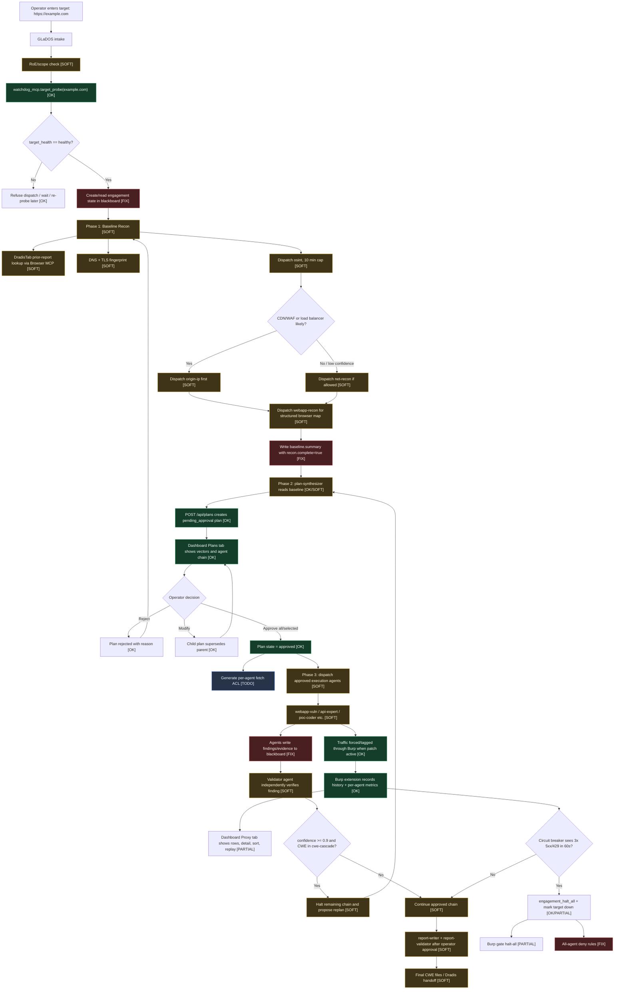
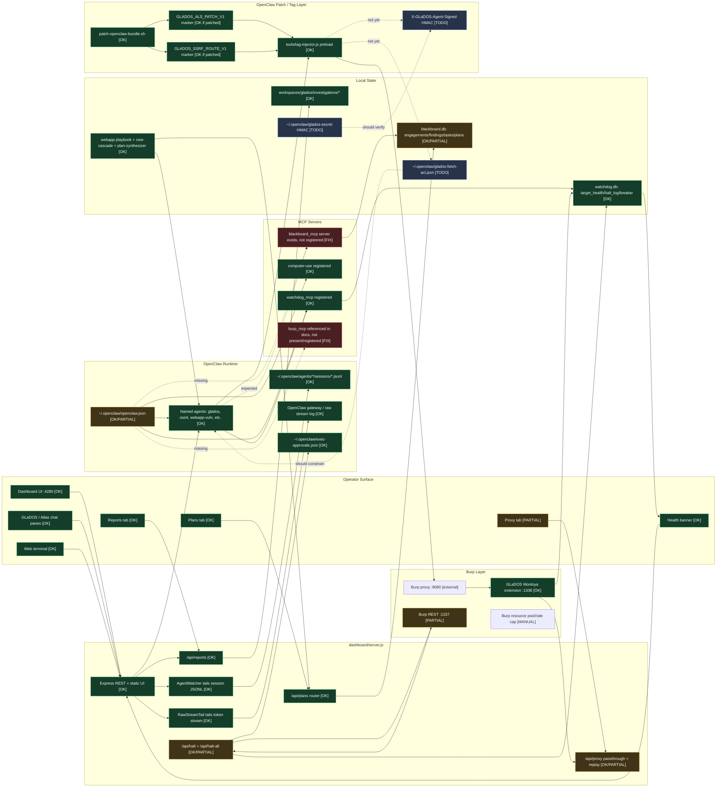

# GLaDOS v3.1.04242026 Flow Diagrams

This document shows how a v3.1 web application assessment is supposed to move
through GLaDOS, and how the local pieces connect. Status markers:

- `[OK]` implemented and wired in the current tree.
- `[SOFT]` documented or prompt-enforced, but not a hard technical gate.
- `[FIX]` present but broken, missing from active config, or incomplete.
- `[TODO]` planned v3.1/Tier 2+ work not implemented yet.

## Web App Assessment Flow: `example.com`

## System Wiring And Interaction Map

## What Needs Fixing Before v3.1 Feels Coherent

| Priority | Component | Current state | Fix |
|---|---|---|---|
| P0 | `blackboard_mcp` | Server exists, docs require it, but active `~/.openclaw/openclaw.json` does not register it. | Add it to `mcp.servers`, restart gateway, verify tools appear to agents. |
| P0 | Hard plan gate | Phase invariants are in `SOUL.md`, but dispatch blocking is model/prompt-enforced. | Add a technical `plan_check_dispatch` gate or OpenClaw hook before network-capable agent dispatch. |
| P0 | Halt-all | `engagement_halt_all` flips Burp gate and logs, but does not add deny rules for every agent. | On halt-all, enumerate registered agents and add deny rules for all network tools. |
| P1 | Blackboard task dispatch | `blackboard_task_create` only inserts a row; nothing consumes it. | Rename docs to "audit task" or implement a task dispatcher. |
| P1 | Fetch ACL | Planned but absent; approved plans do not generate `glados-fetch-acl.json`. | Generate ACL on plan approval and enforce it in the SSRF/fetch patch. |
| P1 | HMAC agent header | Planned but absent; `X-GLaDOS-Agent` remains forgeable by local callers. | Add `glados-secret`, signed header emission, and verification in the Burp extension. |
| P1 | Burp MCP | Docs reference `burp_mcp`, but current integration is dashboard REST plus Burp extension. | Either implement/register Burp MCP or update docs to call it the dashboard/Burp extension API. |
| P2 | Proxy Tier 2 UI | Sort and search inputs are present; replay endpoint exists. Modal/search behavior still needs verification/completion. | Finish replay modal, search highlighting/counts, and browser smoke test. |
| P2 | Getting Started Tier 2 | Current tab is mostly prose; health banner exists. | Add localStorage checklists, validation buttons, copy buttons, and deep links. |
| P2 | Specialist tool docs | Many agent `TOOLS.md` files are still generic templates. | Replace with role-specific allowed tools, output schemas, and evidence rules. |

## Recommended Next Step

Make v3.1 reliable before adding more features:

1. Register `blackboard_mcp` in `~/.openclaw/openclaw.json`.
2. Implement a hard `plan_check_dispatch` MCP/tool gate.
3. Strengthen `engagement_halt_all` to deny all network-capable tools for all agents.
4. Finish and browser-test the partially implemented Proxy Tier 2 UX.

